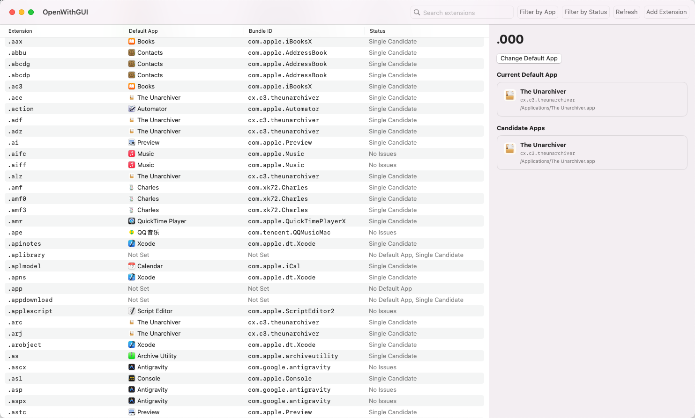

# OpenWithGUI

OpenWithGUI is a macOS desktop app for inspecting and editing file extension default-app associations in one place.

Instead of going through Finder's `Get Info -> Open with -> Change All...` flow one extension at a time, OpenWithGUI gives you a table-first manager for the current system state.

[中文说明](README.zh-CN.md)

## Screenshot

## What It Does

- Lists extension-to-default-app associations in a single table.
- Shows the current default app, bundle ID, and status for each extension.
- Filters rows by default app and status.
- Searches by extension only, so results stay predictable.
- Supports multi-select, then assigns one app to all selected extensions in one action.
- Shows candidate apps for a single extension before changing it.
- Lets you add custom extensions and remove user-added ones.

## Requirements

- macOS 14 or later
- No Swift or Xcode installation is required to use the packaged app or DMG.

## Install From DMG

Download or open the DMG, then drag `OpenWithGUI.app` into `Applications`.

If macOS blocks the app because it is from an unidentified developer, allow it manually:

1. Drag `OpenWithGUI.app` into `Applications`.
2. In Finder, right-click `OpenWithGUI.app`.
3. Click `Open`.
4. Click `Open` again in the confirmation dialog.

You can also allow it from `System Settings -> Privacy & Security` if macOS shows a security warning there.

## Why It Exists

macOS makes default-app management tedious:

- You have to change associations one file type at a time.
- The system does not offer a central panel for reviewing everything.
- It is hard to see which app currently owns a given extension.
- Some apps register broad associations and leave behind confusing state.

OpenWithGUI is meant to make that state visible and editable without requiring users to memorize bundle IDs or click through repeated Finder dialogs.

## License

This project is licensed under the [MIT License](LICENSE).

## Similar Projects

- [ColeMei/openwith](https://github.com/ColeMei/openwith) - a Rust TUI project for managing macOS file extension associations from the terminal.

## Acknowledgements

- [linux.do](https://linux.do/)
